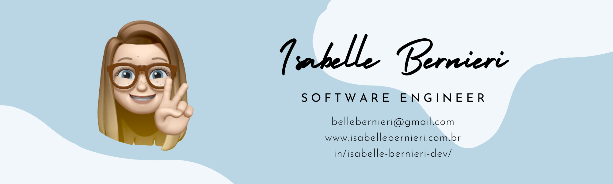

#  Welcome to my GitHub profile!

Hello World! I'm Isabelle Bernieri, a web developer passionate about technology. This is my space where I share personal projects, contributions to the open-source community, and my ongoing learning in the programming world..

## About me

- 👩‍💻 Full Stack Developer.
- 🎓 Graduated in Systems Analysis and Development from UFPR.
- 🌱 Currently enrolled in a postgraduate course in Mobile Development at PUCPR.
- 🐾 Passionate about pets.
- 💬 Ask me about: Software Development.

## Technologies I use in my day-to-day

### Languages and Technologies

### Frameworks and Libraries

### Tools and Platforms

## Projects

Check out some of my projects:

- [Adote um Vira Lata](link): Simplified adoption platform, integrating APIs and advanced technologies in React.js, Node.js, and MongoDB to streamline the animal adoption process and enable efficient donations to the non-governmental organization called 'Adote um Vira Lata'
  

##  Let's connect!

Thank you for visiting my profile! Feel free to explore my projects and reach out if you'd like to collaborate or just chat about technology. 😊

<!--
**belleb23/belleb23** is a ✨ _special_ ✨ repository because its `README.md` (this file) appears on your GitHub profile.

Here are some ideas to get you started:

- 🔭 I’m currently working on ...
- 🌱 I’m currently learning ...
- 👯 I’m looking to collaborate on ...
- 🤔 I’m looking for help with ...
- 💬 Ask me about ...
- 📫 How to reach me: ...
- 😄 Pronouns: ...
- ⚡ Fun fact: ...
-->
